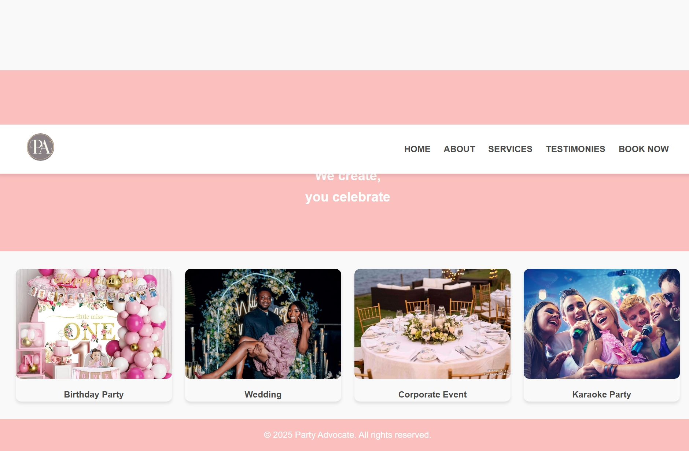
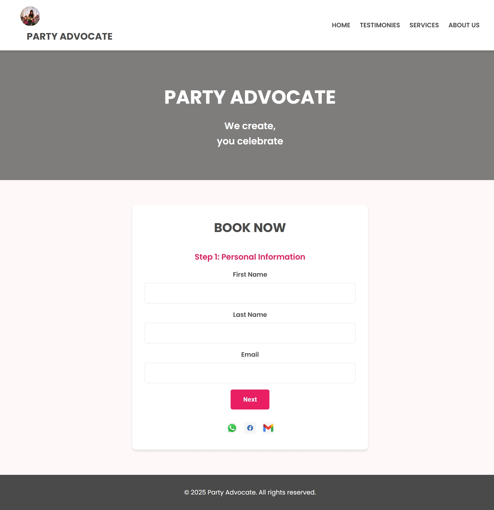

# Party Advocate Events Website

A simple website built with HTML and CSS for Party Advocate Events, featuring a booking form and social media links.

## Features

- Multi-step booking form for user input.
- Social media icons linking to WhatsApp, Facebook, and Email.
- Responsive design for all screen sizes.

## Installation

To run this project locally:

1. Clone the repository:
   ```bash
   git clone https://github.com/mah-kenzie/myproject.git
   cd myproject
   open index.html

## USAGE
Fill out the booking form to submit your details.
Use the social media icons at the bottom of the page to contact us via WhatsApp, Facebook, or Email.

## Screenshots
Here are some visuals of the project:



Caption: Home page of the website.



Caption: Multi-step booking form with social media links

## TECHNOLOGIES USED
HTML5 : For structuring the content.
CSS3 : For styling and layout.
Font Awesome : For social media icons.

## CONTACT
For questions or feedback, feel free to reach out:

Email: emeraldfidelis302@gmail.com
WhatsApp: https://wa.me/elizabethaugustineele
Facebook: https://www.facebook.com/ElizabethFidelis